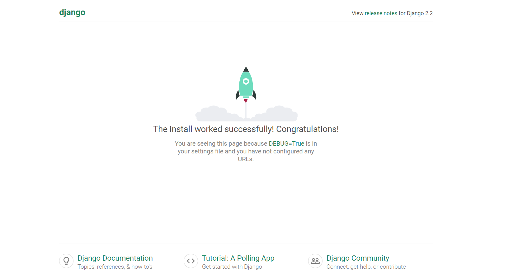

# Python・Django・Anacondaでの環境構築手順の紹介(Windows版)

## １. Anacondaのインストール
- [Anacondaのダウンロードページ](https://www.anaconda.com/distribution/)から、Windows用のAnacondaをダウンロード・インストールする   
    参考 ↓   
    - [AnacondaをWindowsnにインストールする手順](https://weblabo.oscasierra.net/python-anaconda-install-windows/)  
    - [AnacondaのPathをWindowsで通す話](https://sukitokuportfolio.wordpress.com/2018/11/20/anaconda%E3%81%AEpath%E3%82%92windows%E3%81%A7%E9%80%9A%E3%81%99%E8%A9%B1/)

## 2. Anaconda Promptを起動し、下記のコマンドを実行する

1. `conda -create -m [環境名] python=[version]` で仮想環境を構築  
    - ※上手くいかない場合は、`conda update -n base conda` を投入後に上記のコマンドを投入すれば、上手くいくかも  
    - 仮想環境を構築できた場合、C:\\Users\\[user_name]\\Anaconda3\\envs の中に[環境名]のディレクトリが作成される

2. `activate [環境名]` で作成した仮想環境へ入る
    - `deactivate` で仮想環境から抜けられる 

3. `conda install django` で仮想環境にDjangoをインストール  

4. `cd`コマンドでDjangoプロジェクトを置きたい場所へ移動
    - 今回はC:\\Users\\[user_name]\\Anaconda3\\envs\\[環境名]へ移動

5. `django-admin startproject [プロジェクト名]` でDjangoプロジェクトを作成

6. `cd [Djangoプロジェクト]` でプロジェクト下へ移動

7. `python manage.py runserver` でサーバ起動
    - `ModuleNotFoundError: No module named 'sqlparse'` というエラーが発生した場合、`conda install sqlparse` でsqlparseをインストールする

## 3. http://localhost:8000/ へアクセス

- 上記の画面が表示されれば成功！